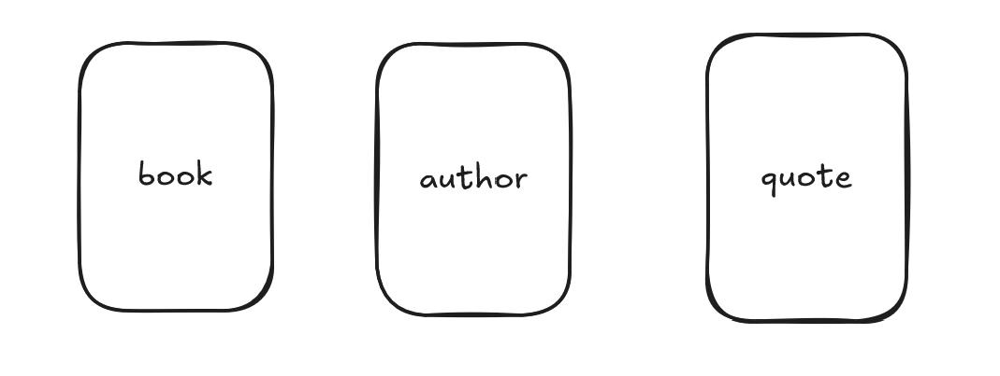

# Domain

The domain contains three main aggregates: Book, Author, and Quote.

A Book may exist without authors or quotes, and the same applies to the other aggregates. The idea is that they can coexist independently, leaving it up to the client to decide how to consume the API.

This separation of aggregates comes from a conscious design decision: working with more isolated units makes the system more independent, organized, and easier to test. Avoiding forced relationships at this stage brings flexibility and clarity, while reducing unnecessary coupling.

Data creation and retrieval will be implemented independently for each aggregate, allowing for better modeling on top of a BFF (Backend for Frontend).

One of the main reasons for introducing a layered architecture was to keep the project simple and approachable: with minimal knowledge of DDD and the file structure, any developer should be able to quickly identify the domain logic and the API.

Additionally, the separation by aggregates and layers allows for clearer and more isolated unit tests, ensuring that each piece can be validated without unnecessary cross-dependencies.

Regarding naming conventions, English will be consistently used for entities, files, and components, keeping a uniform standard throughout the project.

For organizational purposes, each domain has its own folder for value objects. Domain errors and events will be gradually added in order to move towards a more robust domain model.